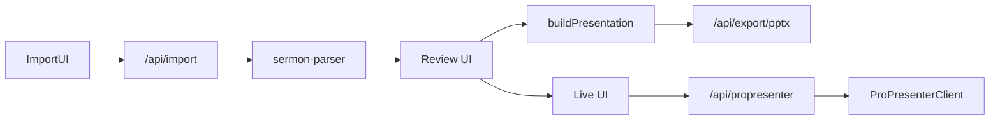

# Sermon Studio

macOS-first **local** web app for sermon manuscript import (Word `.docx` or `.pdf`), heuristic structure extraction, human review, optional **PowerPoint export**, and **ProPresenter** control via a dedicated server-side service layer (mock by default).

All **UI copy is English**. The sermon’s **source of truth** is validated **JSON** (`SermonDocument`, `PresentationModel`), not PowerPoint.

## Prerequisites

- **Node.js** 20+
- npm (bundled with Node)

## Setup

```bash
npm install
cp .env.example .env.local   # optional — see Environment
npm run dev
```

Open [http://localhost:3000](http://localhost:3000).

## Scripts

| Command        | Purpose                          |
| -------------- | -------------------------------- |
| `npm run dev`  | Next.js dev server (Turbopack)   |
| `npm run build`| Production build                  |
| `npm run start`| Run production server             |
| `npm run lint` | ESLint                            |
| `npm run test` | Vitest watch                      |
| `npm run test:run` | Vitest CI mode               |

## Workflow

1. **Import** — Upload `.docx` or `.pdf`. Text is parsed on your machine via Next.js API routes (`/api/import`).
2. **Review** — Edit detected blocks (title, verses, points, quotes, etc.), reorder with drag-and-drop, **Save**, then **Rebuild slides**.
3. **Live** — Trigger slides through `/api/propresenter` using the mock client or a real HTTP client when a base URL is configured.
4. **Export** — Optional `.pptx` download from Review (**Export PPTX**), generated from `PresentationModel` only.

## Architecture

- **Frontend:** Next.js App Router, React 19, TypeScript (strict), Tailwind CSS v4, `next-themes`, `@dnd-kit` for reordering blocks.
- **Domain:** Zod schemas in [`src/lib/domain/sermon.schema.ts`](src/lib/domain/sermon.schema.ts).
- **Import:** Mammoth (DOCX), `pdf-parse` v2 `PDFParse` class (PDF) — API routes use **Node.js runtime** (`export const runtime = "nodejs"`).
- **Parser:** Deterministic heuristics in [`src/lib/parser/sermon-parser.ts`](src/lib/parser/sermon-parser.ts); optional passthrough [`enrich.ts`](src/lib/parser/enrich.ts) for future LLM enrichment.
- **Slides:** [`buildPresentation`](src/lib/presentation/builder.ts) maps blocks → `PresentationModel`; themes in [`theme.ts`](src/lib/presentation/theme.ts).
- **PPTX:** [`presentationToPptxBuffer`](src/lib/export/pptx.ts) using `pptxgenjs` — **export adapter only**.
- **ProPresenter:** [`ProPresenterClient`](src/lib/propresenter/types.ts) implemented by [`mock.ts`](src/lib/propresenter/mock.ts) and [`http.ts`](src/lib/propresenter/http.ts). The UI **never** calls ProPresenter directly; it uses [`/api/propresenter`](src/app/api/propresenter/route.ts).
- **Persistence (MVP):** Browser `localStorage` via [`src/lib/client/storage.ts`](src/lib/client/storage.ts).

### Data flow



## Environment

See [`.env.example`](.env.example).

- **`PROPRESENTER_BASE_URL`** — Optional default REST base URL on the **Next.js server** (e.g. `http://127.0.0.1:50001`).
- **`PROPRESENTER_USE_MOCK=true`** — Force the mock client even if a base URL exists (useful for demos/tests).
- **`PROPRESENTER_TOKEN`** — Optional bearer token for HTTP client.

The **Settings** page also stores an optional per-browser base URL and presentation ID in `localStorage`; requests to `/api/propresenter` pass `baseUrl` in the JSON body so the server can construct an HTTP client without exposing credentials to the client bundle.

## ProPresenter HTTP integration

Paths in [`src/lib/propresenter/http.ts`](src/lib/propresenter/http.ts) are **placeholders**. Align them with your ProPresenter major/minor version using the official OpenAPI description ([openapi.propresenter.com](https://openapi.propresenter.com/)) and your network preferences in ProPresenter.

## Demo data

[`src/lib/demo/seed-sermon.json`](src/lib/demo/seed-sermon.json) loads via **Load demo sermon** on the Import screen (`loadDemoSermon()`).

## Tests

Parser, presentation builder, and demo seed validation live under `src/**/*.test.ts` and run with Vitest.

## Next steps

- **Tauri** (or Electron) shell for a true desktop bundle and filesystem access.
- **Keynote export** using the same `PresentationModel` ([`src/lib/export/keynote.ts`](src/lib/export/keynote.ts) placeholder).
- **LLM enrichment** behind `enrichSermonDocument`.
- **Wire real ProPresenter REST endpoints** in `http.ts` after validating against your installed version.
